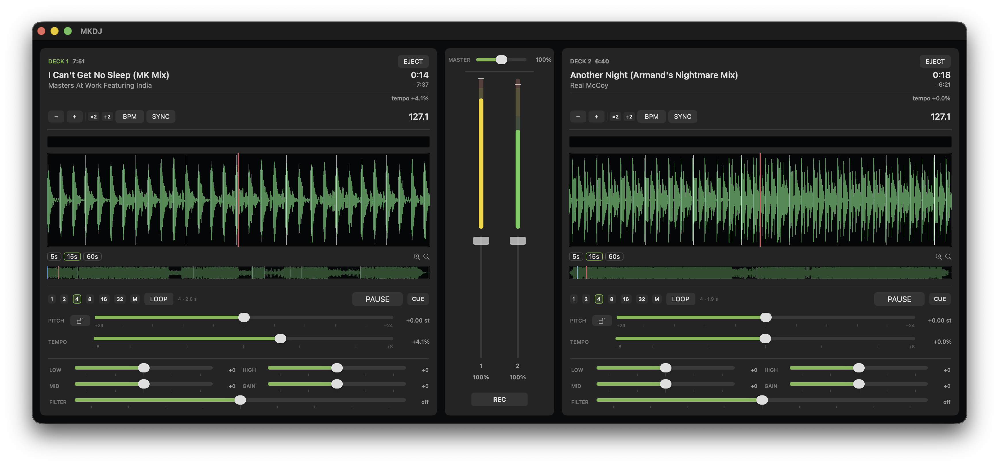

# MKDJ — 2-deck DJ sketchpad for Mac

MKDJ (Mouse & Keyboard DJ) is a free, open-source 2-deck DJ app for working out whether two tracks mix. Load a track on each deck, cue, loop, beatmatch, and play them together. It is built for preparing sets and sketching mix ideas, not for live performance.

macOS 14+, Apple Silicon, no accounts, no telemetry. The audio you load never leaves your machine.

<p align="center"></p>

## Download

**[MKDJ-0.1.0-arm64.dmg](https://github.com/skseq/MKDJ/releases/download/v0.1.0/MKDJ-0.1.0-arm64.dmg)** — free, macOS 14+, Apple Silicon. The app is unsigned: on first launch, confirm via **System Settings ▸ Privacy & Security ▸ Open Anyway**. All releases [here](https://github.com/skseq/MKDJ/releases).

## What it does

- **Two decks** — drop audio on either lane (MP3, FLAC, WAV, AIFF, M4A, OGG, Opus, WMA, AAC, AMR). Tagged files show their title and artist; untagged ones show the filename. Each deck has a three-level waveform: overview strip, zoomed scrolling view, and beat-grid text display.
- **Platter-style waveform interaction** — this is not a world-class emulation of CDJ hardware; DAWs and dedicated DJ platforms exist for flawless reproduction. It is a rough, macOS-only tool for testing mix ideas. Dragging a playing deck jogs the audio with vinyl-style pitch follow, releasing with velocity throws, a paused deck scrubs under the cursor, and overview drags place a pending marker that seeks once on release.
- **Loops** — beat loops (1–32, ×2/÷2, re-loop) snapped to the analyzed grid, plus a manual loop whose span you set by dragging its handles directly on the waveform.
- **Tempo & pitch** — ±8/16/32% faders with fine drag, pitch bend, keylock (SoundTouch time-stretch in the render path), and Match-BPM with octave folding into a sane rate range.
- **Mixer** — 3-band ±12 dB EQ per deck (right-click a band label for a momentary full cut), filter, gain, master volume. Faders support eased snapback on release (0–0.5 s, configurable).
- **Recording** — capture the session to timestamped WAV in ~/Documents/MKDJ Output.

## Controls

- **Play / Cue** — instant-play transport. CUE holds a preview from your cue point (press-mode jumps to the cue and plays through), and the BPM readout doubles as a tap-tempo: tap in time to re-fit the grid by hand.
- **SYNC** — matches this deck's tempo to the other deck's. The tempo fader follows the match, and toggling SYNC off leaves the tempo where it is. Dragging the fader while synced disengages sync.
- **Keyboard is opt-in** — the app consumes stray keypresses silently (no beeps). Hotkey bindings are off until you record your own in Settings ▸ Shortcuts.

## What's MKDJ for really?

When I'm deep into a listening session or digging session, inspiration might strike quickly. I'll hear something and immediately think of an acapella that would fit, or a transition that would go great, and I want to test it out as fast as I can. Sure, I can open up Ableton and drag both files in and do some tweaking, but most times opening Ableton also means I'm about to get serious, when really I'm just sidequesting this little idea while I'm still in a discovery phase — a.k.a. "it's not that serious". So I created MKDJ (Mouse & Keyboard DJ), a free/open-source macOS mixer+decks to quickly test out mp3s. If you've got Serato/Traktor/Ableton experience, a lot of this will already make sense. If not, figure it out. It's fast, light, and good enough to scratch the itch, to see if your idea could really work. Also has some looping, both in beat windows and manual in/out handles, and a record to wav feature if you want to commit what you did to a rendered file.

## Beat analysis

Track analysis runs the **[BPMPLS](https://github.com/skseq/BPMPLS)** engine — a multi-band tempo estimator where onset-path measurement decides, metrical relatives arbitrate, and your detection range acts as a search bound, not a projector. When the deciding engine abstains on an ambiguous track, the BPMPLS verdict itself carries the result, so a reading surfaces for anything with a pulse. The grid powers loop snapping and beat jumps; analysis caches in Application Support.

## Building & tests

```sh
./build.sh                    # MKDJ.app + build/mkdjprobe (arm64)
swift Tools/makeicon.swift build/AppIcon.iconset && \
  iconutil -c icns build/AppIcon.iconset   # regenerate the app icon
./build/mkdjprobe --selftest   # scheduler gates: audible position ±10 ms, cue
                               # state machine, loops, beat jumps, throws
./build/mkdjprobe files…       # per-file BPM verdict/confidence/beats
./build/mkdjprobe --syncab A B # the sync contract end-to-end over two real
                               # files: match, hold, exact cue under spam
```

A dozen more diagnostic gates cover the rest (`--loopdiag`, `--cuediag`, `--eqdiag`, `--pitchdiag`, `--beepdiag`, `--hotkeydragdiag`, …).

`MKDJ_DEMO=1 MKDJ.app/Contents/MacOS/MKDJ` loads two synthetic tracks and plays deck A — for loaded-state screenshots.

Vendored third-party code lives under `Sources/Audio/Stretch/vendor/` with its licenses: FFmpeg (LGPL-2.1+), SoundTouch (LGPL), fishhook (MIT), Signalsmith stretch/linear.

## Known limits

- AVAudioUnitTimePitch adds a constant ~82 ms phase lead between the scheduler's position and the audible position; MKDJ compensates unconditionally (measured by `mkdjprobe --selftest`).
- Natural end-of-file drains ~230 ms after the last content, and the final ~80 ms may fade oddly at rate ≠ 1.
- Match-BPM folds the required rate into [0.5, 2.0]; a 70 vs 140 pair matches at 140.

## License

MIT — see [LICENSE](LICENSE). `LLM development by SKSoft.`

MKDJ is part of the SKSoft Mac audio tools family — see also **[BPMPLS](https://github.com/skseq/BPMPLS)**, the batch BPM analyzer & tagger whose beat engine MKDJ shares.
